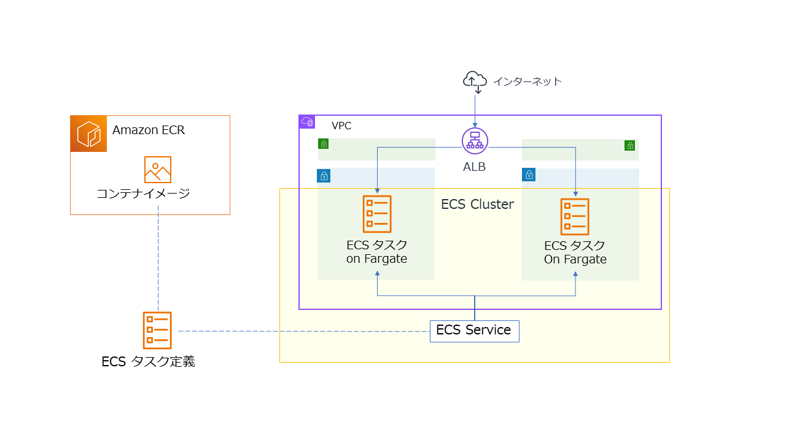

# Amazon Elastic Container Service (ECS) と AWS Fargate のワーク

* このワークは、指定された AWS アカウントと IAM ユーザー/パスワードを使用して実施して下さい。
* ワークの環境は、許可されている期限内でのみ利用可能ですのでご了承ください。
---

## ワークの目的

* Amazon ECS クラスターで AWS Fargate を使用し、コンテナアプリケーションを実行するまでの手順をハンズオンで体験します。
    - コンテナイメージの構築から始めます。
    - コンテナイメージは、Amazon Elastic Container Registry (ECR) のリポジトリに格納します。

---

## 全体概要

* 下図のような環境を構築します。



## 手順

### 0. 事前準備

* このワークを実施するために必要な 下記の AWS リソースを AWS CloudFormation で作成します。

1. AWS マネジメントコンソールにサインインして、リージョンに **東京** を指定します。

1. ページ上部の **検索** に `cfn` を入力して Enter キーを押下します。

1. AWS CloudFormation のページの左側のナビゲーションメニューで **スタック** をクリックします。

1. **スタックの作成** から **新しいリソースを使用（標準）** を選択します。

1. **テンプレートの指定** セクションで **テンプレートソース** に **Amazon S3 URL** を選択します。

1. **Amazon S3 URL** に下記を入力します。
    - `https://tnobep-work-public.s3-ap-northeast-1.amazonaws.com/ecs-work/ecs_work_main.yaml`

1. **次へ** をクリックします。

1. **スタック名** に `ecs-work` と入力します。

1. **次へ** をクリックします。

1. ページを下にスクロールし、下記の両方にチェックします。
    - **AWS CloudFormation によって IAM リソースがカスタム名で作成される場合があることを承認します。**
    - **AWS CloudFormation によって、次の機能が要求される場合があることを承認します: CAPABILITY_AUTO_EXPAND**

1. **次へ** をクリックします。

1. **送信** をクリックします。

1. スタックの作成が完了するまで待ちます。(約 15分～20分ほどかかります。)

1. **出力** タブをクリックします。

1. **PasswordURL** の URL をコピーして新しいブラウザのタブで開きます。

1. **シークレットの値** セクションで **シークレットの値を取得する** をクリックします。

1. **プレーンテキスト** に表示されるパスワードをメモしておきます。
    - この パスワード は後の手順で使用します。

1. AWS CloudFormation のコンソールに戻ります。

1. **VSCodeServerURL** の URL をメモしておきます。
    - この URL は後の手順で使用します。

### 1. コンテナイメージの構築

1. ブラウザで新しいタブを開き、VS Code Server の URL を開きます。
   - メモしておいたパスワードを入力して

1. ターミナル で下記のコマンドを実行し、Docker がインストールされていることを確認します。   
   ```
   docker -v
   ```

1. サンプルの Git リポジトリを取得します。

   ```
   git clone https://github.com/tetsuo-nobe/ecs_work.git
   ```

1. サンプルのフォルダに移動します。

   ```
   cd ecs_work/myflask
   ```
   
1. 左側に表示されている階層構造から myflask/app フォルダの app.py を開いて、サンプルの アプリケーションのコードを確認します。(Python で Flask という Webアプリケーションフレームワークを使用しています。）


1. myflask フォルダの Dockerfile を確認します。
   - この Dockerfile を使用してコンテナのイメージをビルドします。


1. 下記のコマンドでコンテナイメージをビルドします。
   ```
   docker build -t myflask:1 . 
   ```   

1. 下記のコマンドでコンテナを実行します。
   ```
   docker run --name myflask1 -dit -p 81:8080 myflask:1
   ```   

1. サンプルアプリケーションのコンテナが動作していることを確認します。CONTAINER ID や NAMES が表示されていることを確認します。
   ```
   docker ps
   ```
   
1. サンプルアプリケーションのコンテナにアクセスします。
   ```
   curl localhost:81
   ```
   - `<h1>Hello, Flask!</h1>` と表示されることを確認します。

1. サンプルアプリケーションのコンテナを停止します。
   ```
   docker stop myflask1
   ```

### 2. Amazon ECR のリポジトリを作成しコンテナイメージをプッシュする

1. 使用している AWS アカウント ID とリージョンを環境変数に設定します。
    - 下記は例です。ご自身の環境に応じた値に変更して下さい。
   
   ```
   ACCOUNT=123412341234
   ```

   ```
   REGION=ap-northeast-1
   ```

1. ターミナルで下記のコマンドを実行し、Amazon ECR のリポジトリ myflask1 を作成します。

   ```
   aws ecr create-repository --repository-name myflask --region ${REGION}
   ```
   - **実行後、プロンプトが戻らない場合はキーボードの q キーを押下して下さい。**

1. 認証トークンを取得し、レジストリに対して Docker クライアントを認証します。

   ````
   aws ecr get-login-password --region ${REGION} | docker login --username AWS --password-stdin ${ACCOUNT}.dkr.ecr.${REGION}.amazonaws.com
   ````

1. リポジトリにイメージをプッシュできるように、イメージにタグを付けます。

   ````
   docker tag myflask:1  ${ACCOUNT}.dkr.ecr.${REGION}.amazonaws.com/myflask:latest
   ````

1. リポジトリにこのイメージをプッシュします。

   ````
   docker push ${ACCOUNT}.dkr.ecr.${REGION}.amazonaws.com/myflask:latest
   ````

1. AWS マネジメントコンソールで Amazon ECR のページを表示し、リポジトリにイメージがプッシュされたことを確認します。


1. 次の手順に備えて、下記のコマンドで表示されるイメージ URI をメモしておきます。

    ````
    echo ${ACCOUNT}.dkr.ecr.${REGION}.amazonaws.com/myflask:latest
    ````

### 3. Amazon ECS タスク定義の作成

1. AWS マネジメントコンソールで Amazon ECS のページを表示します。


1. 左側のナビゲーションメニューから **タスク定義** をクリックします。

1. **新しいタスク定義の作成** をクリックして、さらに **新しいタスク定義の作成** をクリックします。

1. **タスク定義ファミリー** に `myflask` と入力します。

1. **インフラストラクチャの要件** で **起動タイプ** に **Fargate** だけがチェックされた状態にします。

1. ページを少し下にスクロールし、**コンテナ - 1** で下記を入力します。
    - **名前** に `myflask` と入力
    - **イメージ URI** にメモしておいた イメージ URI を入力
    - **ポートマッピング** で **コンテナポート** に `8080` を入力
    - 上記以外はデフォルトのままにします。
    - 入力後、ページを下までスクロールして、**作成** をクリックします。

### 4. Amazon ECS クラスターの作成

1. 左側のナビゲーションメニューから **クラスター** をクリックします。

1. ページ右上あたりにある **クラスターの作成** をクリックします。

1. **クラスター設定** で **クラスター名** に `my-cluster` を入力します。

1. **インフラストラクチャ** で **AWS Fargate (サーバーレス)** だけがチェックされている状態にします。

1. ページを下までスクロールして、**作成** をクリックします。
   - クラスターの作成が完了するまで待ちます。

### 5. Amazon ECS クラスターでサービスの作成


1. 表示されるクラスター一覧から **my-cluster** のリンク をクリックします。

1. ページ中央あたりにある **サービス** のタブをクリックして、**作成** をクリックします。

1. ページを少し下にスクロールし、**デプロイ設定** セクションを表示します。

1. **ファミリー** で **myflask** を選択します。

1. **サービス名** に `my-service` と入力します。

1. **必要なタスク** に `2` と入力します。

1. ページを少し下にスクロールし、**ネットワーク** セクションを展開表示します。

1. **VPC** で、`my-VPC` を選択します。

1. **サブネット** で、**PublicSubnet01** と **PublicSubnet02** の **X** をクリックして削除します。
    - 結果、**PrivateSubnet01** と **PrivateSubnet02** だけが選択された状態にします。
   
1. **セキュリティグループ** で **既存のセキュリティグループを使用** を選択します。

1. **セキュリティグループ名** で **AppSG** を選択します。
    - **default のセキュリティグループは、X をクリックして削除して下さい。**

1. **パブリック IP** のトグルを OFF (無効化)します。

1. **ロードバランシング - オプション** セクションを展開表示します。

1. **ロードバランシングを使用** をチェックします。

1. **ロードバランサーの種類** で **Application Load Balancer** を選択します。

1. **Application Load Balancer** で **既存のロードバランサーを使用** を選択します。

1. **ロードバランサー** で **myALB** を選択します。

1. **リスナー** で **既存のリスナーを使用** を選択します。

1. **リスナー** で **80:HTTP** を選択します。

1. **ターゲットグループ** で **既存のターゲットグループを使用** を選択します。

1. **ターゲットグループ名** で **TargetGroup** を選択します。
 
1. ページを下までスクロールして、**作成** をクリックします。
   - my-service のデプロイが完了するまで待ちます。

### 6. タスクの実行確認

1. 表示されるサービス一覧から **my-service** のリンク をクリックします。

1. ページ中央あたりにある **設定とネットワーク** のタブをクリックします。

1. ページを少し下にスクロールして、**ネットワーク設定** を表示します。

1. **DNS 名** の **オープンアドレス** をクリックします。
    - ブラウザで新しいタブが開き、**Hello, Flask!** と表示されることを確認します。
    - 注意: 表示されない場合は https ではなく、http でアクセスしていることを確認してください。


---

### 7. 作成したリソースの削除

#### インストラクターの指示に基づいて、下記の手順でリソースを削除して下さい。

1. **my-service** のページから、**サービスを削除** をクリックします。

1. **my-service サービスを削除しますか?** のダイアログで、**強制削除** をチェックします。

1. テキスト入力フィールドに `削除` と入力し、**削除** をクリックします。

1. **my-cluster** のページで、**クラスターの削除** をクリックします。

1. **my-cluster を削除** のダイアログで、必要なフレーズを入力して **削除** をクリックします。
    - my-cluster が削除されるまで待ちます。

1. ページ上部の **検索** に `cfn` と入力して Enter キーを押下し、CloudFormation のページに移動します。

1. **スタックの一覧** から　**ecs-work** を選択して、**削除**　をクリックします。
    - 確認ダイアログで **削除** をクリックします。
    - 削除にしばらく時間がかかるので、次の手順に進みます。

1. ページ上部の **検索** に `elastic container registory` と入力して Enter キーを押下し、Amazon ECR のページに移動します。

1. プライベートリポジトリで **myflask** を選択して **削除** をクリックします。

1. 確認のダイアログで **削除** をクリックします。

1. 最終的に、AWS CloudFormation のページで、ecs-work スタックが削除されることを確認してください。

#### 以上でワークは終了です。お疲れさまでした！


